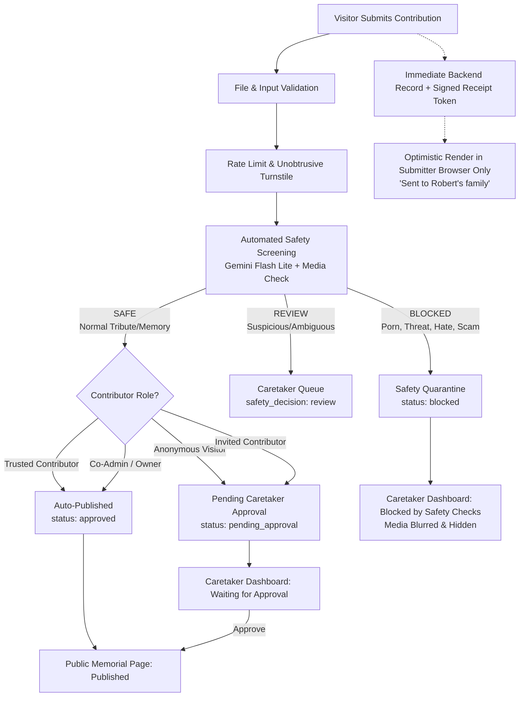

# Implementation Plan: Frictionless-But-Moderated Contributions & Automated Safety Pipeline

Transform Theirs memorial contributions into a frictionless yet strongly protected model according to [`docs/security.md`](file:///e:/tutorial/theirs/docs/security.md): anonymous visitors contribute with zero mandatory accounts or emails, every submission is screened by an automated safety pipeline (powered by Gemini Flash Lite), private media quarantine strips EXIF/GPS metadata, optimistic receipts render instantly in the contributor's browser with respectful wording ("Sent to family"), and caretakers receive 3-tier moderation queues and granular contribution controls.

---

## Architecture Overview



---

## Proposed Changes

### 1. Database Schema & Idempotent Migration

#### [NEW] [11_contribution_safety_and_trust.sql](file:///e:/tutorial/theirs/supabase/theirs_migrations/11_contribution_safety_and_trust.sql)
- Add columns to `public.memories`:
  - `receipt_token text unique` (for anonymous contributor optimistic tracking)
  - `safety_decision text check (safety_decision in ('safe', 'review', 'blocked')) default 'safe'`
  - `safety_details jsonb default '{}'::jsonb` (flags for sexual, threat, hate, harassment, spam, scam, reason)
  - `contributor_role text default 'anonymous' check (contributor_role in ('anonymous', 'invited', 'trusted', 'co_admin', 'owner'))`
  - Update `status` check to include `'blocked'` (`status in ('pending_approval', 'approved', 'rejected', 'blocked')`)
  - `is_quarantined boolean default false`
- Add to `public.collaborators`:
  - `is_trusted boolean not null default false`
- Add to `public.memorials`:
  - `contribution_settings jsonb default '{"accept_contributions":true,"tributes":true,"memories":true,"photos":true,"voice":true,"videos":true,"moments":true}'::jsonb`
- Indexes:
  - `idx_memories_receipt_token on public.memories(receipt_token)`
  - `idx_memories_moderation_queue on public.memories(memorial_id, status, safety_decision, created_at desc)`

#### [MODIFY] [types/theirs.ts](file:///e:/tutorial/theirs/types/theirs.ts)
- Add `ContributionSettings` interface:
  ```typescript
  export interface ContributionSettings {
    accept_contributions?: boolean
    tributes?: boolean
    memories?: boolean
    photos?: boolean
    voice?: boolean
    videos?: boolean
    moments?: boolean
  }
  ```
- Update `MemoryStatus` to include `'blocked'`.
- Update `Memory` to include `safety_decision`, `safety_details`, `receipt_token`, `contributor_role`, `is_quarantined`.
- Update `Collaborator` to include `is_trusted`.
- Update `Memorial` to include `contribution_settings`.

---

### 2. Automated Safety Screening Pipeline (Gemini Flash Lite + Media Sanitation)

#### [NEW] [lib/safety/moderation.ts](file:///e:/tutorial/theirs/lib/safety/moderation.ts)
- **Text Safety Classifier**:
  - Leverages `@google/genai` with `gemini-2.5-flash-lite` / `gemini-2.0-flash-lite` with fallback to `gemini-2.5-flash`.
  - Strict system prompt returning deterministic JSON:
    `{ decision: "safe" | "review" | "block", sexual: boolean, threat: boolean, hate: boolean, harassment: boolean, spam: boolean, scam: boolean, personal_data: boolean, garbage: boolean, reason: string }`
  - Local rule-based safety fallback (regex for spam URLs, explicit harassment, scam patterns) if API key is not configured or network fails open safely into `review`.
- **Image File Validation & EXIF Stripping**:
  - Validates magic bytes (JPEG `FF D8 FF`, PNG `89 50 4E 47`, WebP `RIFF...WEBP`).
  - Strips EXIF APP1 metadata chunks (removing GPS coordinates and camera serial numbers) in pure JS without native binary dependencies.
  - Multimodal Gemini safety check on image buffer for explicit/NSFW, violence, or scam flyers.
- **Audio / Video Moderation**:
  - Validates container MIME & magic bytes.
  - Audio transcription and moderation via Gemini audio processing.
  - Video keyframe sampling + audio transcript moderation.

#### [MODIFY] [app/api/r2/upload/route.ts](file:///e:/tutorial/theirs/app/api/r2/upload/route.ts)
- Distinguish between authenticated caretaker uploads and public contribution uploads:
  - Contribution uploads are placed into a **private quarantine prefix** (`quarantine/${memorialId}/...`).
  - EXIF/GPS metadata is stripped before writing to R2.
  - Quarantined URLs are signed or private, preventing public hotlinking before approval.
- Expose a helper to promote approved media from `quarantine/` to `memorials/${memorialId}/` upon approval.

---

### 3. Contribution API & Optimistic Receipt Flow

#### [MODIFY] [app/api/memorials/[id]/contribute/route.ts](file:///e:/tutorial/theirs/app/api/memorials/[id]/contribute/route.ts)
- Validate `memorial.contribution_settings`:
  - If `accept_contributions === false`, reject.
  - If specific type (`tributes`, `memories`, `photos`, `voice`, `videos`, `moments`) is disabled, reject.
- Authenticate contributor role:
  - Check user session against `memorial.owner_id` (Owner) or `collaborators` (Co-admin or Trusted Contributor).
  - Defaults to `anonymous` if not logged in.
- Run Turnstile & Rate Limit.
- Run automated safety pipeline on content and any attached media.
- Moderation Decision Matrix:
  - `block` -> Set `status = 'blocked'`, `safety_decision = 'blocked'`, store in safety quarantine.
  - `review` -> Set `status = 'pending_approval'`, `safety_decision = 'review'`.
  - `safe` ->
    - Owner or Co-Admin: `status = 'approved'`
    - Trusted Contributor: `status = 'approved'` (Auto-publish!)
    - Anonymous or Standard Invited: `status = 'pending_approval'`
- Generate signed `receipt_token`.
- Insert into `memories` table.
- Return response:
  ```json
  {
    "success": true,
    "contribution_id": "uuid",
    "receipt_token": "cr_...",
    "status": "pending_approval" | "approved" | "blocked",
    "item": { ...displayPayload }
  }
  ```

#### [NEW] [app/api/memorials/[id]/contributions/receipt/route.ts](file:///e:/tutorial/theirs/app/api/memorials/[id]/contributions/receipt/route.ts)
- `GET ?token=...`
- Returns public status of the contribution:
  `{ status: "screening" | "sent_to_family" | "published" | "not_published" }`
- Used by client to verify if optimistic submission has been approved or rejected.

---

### 4. Client-Side Optimistic Receipt Experience

#### [NEW] [lib/memorial/optimistic-receipts.ts](file:///e:/tutorial/theirs/lib/memorial/optimistic-receipts.ts)
- Helpers to store and manage local contributor receipts in `localStorage` under `theirs_receipts_${slug}`:
  - `addLocalReceipt(slug, receipt)`
  - `getLocalReceipts(slug)`
  - `removeLocalReceipt(slug, contributionId)`
  - `reconcileReceiptsWithPublic(slug, publicItems)`

#### [MODIFY] [components/memorial/contribute-modal.tsx](file:///e:/tutorial/theirs/components/memorial/contribute-modal.tsx)
- Filter available contribution options dynamically based on `memorial.contribution_settings`:
  - If `tributes` OFF -> hide "Leave a Tribute"
  - If `memories` OFF -> hide "Share a memory"
  - If `photos` OFF -> hide "Share a photograph"
  - If `voice` OFF -> hide "Share a voice note"
  - If `videos` OFF -> hide "Share a video clip"
  - If `moments` OFF -> hide "Share a milestone moment"
- Keep Turnstile unobtrusive/interaction-only (no intrusive challenge modal).
- On submission success:
  - Save receipt and display payload via `addLocalReceipt`.
  - Close modal and notify with warm toast: **"Sent to [Name]'s family."**
  - Trigger optimistic update in the active view without page reload.

#### [MODIFY] [components/memorial/memories-stream.tsx](file:///e:/tutorial/theirs/components/memorial/memories-stream.tsx), [components/memorial/life-stories.tsx](file:///e:/tutorial/theirs/components/memorial/life-stories.tsx), [components/memorial/memorial-gallery.tsx](file:///e:/tutorial/theirs/components/memorial/memorial-gallery.tsx)
- Ingest local pending receipts for the current memorial.
- Render the contributor's pending item immediately in their own browser.
- Display a discreet, gentle indicator badge:
  `Sent to [Name]'s family`
- Once the contribution appears in the public feed, automatically drop the local receipt to prevent duplicates.

---

### 5. Caretaker Moderation Queues & Controls

#### [MODIFY] [app/api/memorials/[id]/moderation/route.ts](file:///e:/tutorial/theirs/app/api/memorials/[id]/moderation/route.ts)
- Support approving, rejecting, and permanently deleting contributions.
- When approving quarantined media, copy/promote R2 object from `quarantine/` to public `memorials/`.
- Endpoint to query moderation queues by status: `pending` vs `published` vs `blocked`.

#### [MODIFY] [components/editor/tabs/moderation-tab.tsx](file:///e:/tutorial/theirs/components/editor/tabs/moderation-tab.tsx)
- Reorganize contributions into 3 distinct sections:
  1. **Waiting for Approval** (`pending_approval`, `safety_decision in ('safe', 'review')`):
     - Displays author, relationship, date, story, attached photos/media.
     - Review badge if flagged for caretaker attention (e.g. "Review recommended: emotional/dispute context").
     - Actions: `Approve` and `Decline`.
  2. **Published** (`approved`):
     - View currently live contributions with option to unpublish or delete.
  3. **Blocked by Safety Checks** (`blocked`):
     - Collapsed by default with count badge.
     - Warning banner explaining automated platform quarantine.
     - All media blurred by default with explicit "View content" / unblur toggle.
     - Displays safety tags (e.g. `Spam/URL`, `Explicit`, `Threat`, `Harassment`) and reason summary.
     - Actions: `Permanently Delete` or `Dismiss`.

#### [MODIFY] [components/editor/tabs/settings-tab.tsx](file:///e:/tutorial/theirs/components/editor/tabs/settings-tab.tsx)
- **Granular Contribution Settings Section**:
  - Master toggle: `Accept contributions` (ON/OFF)
  - Sub-switches:
    - `Tributes & messages` (ON/OFF)
    - `Memories & stories` (ON/OFF)
    - `Photographs` (ON/OFF)
    - `Voice notes` (ON/OFF)
    - `Video clips` (ON/OFF)
    - `Life moments` (ON/OFF)
- **Collaborator Trust Management**:
  - In the Collaborators list, add a switch for each invited collaborator:
    **"Trust [Name]'s contributions"**
    - Description: *"Contributions appear without waiting for family approval. Theirs still runs automated safety checks."*
    - Endpoint update in `/api/memorials/[id]/collaborators` to toggle `is_trusted`.

---

## Verification Plan

### Automated Tests & Type Check
- Run `npx tsc --noEmit` to verify zero type regressions across all modified routes, components, and types.
- Test Gemini safety classifier prompt with test fixtures (safe condolence, spam URL, hostile harassment text) to ensure deterministic structured JSON output.
- Verify EXIF stripping helper on sample JPEG with GPS metadata.

### Manual Verification
1. **Anonymous Visitor Flow**:
   - Open memorial in an incognito window without logging in.
   - Submit a tribute with a photo.
   - Verify Turnstile runs silently.
   - Verify submission succeeds immediately without account prompt.
   - Verify tribute renders instantly in the incognito window with `"Sent to Robert's family"` badge.
   - Verify tribute does NOT appear in a second separate browser window.
2. **Caretaker Moderation Queue**:
   - Open editor in the caretaker window.
   - Navigate to **Contributions**.
   - Verify the pending submission appears under **"Waiting for approval"**.
   - Click **Approve**.
   - Verify the contribution moves to **"Published"** and is now visible publicly in all browsers.
   - Verify the contributor's browser drops the optimistic receipt and shows the live public version.
3. **Safety Quarantine**:
   - Submit simulated prohibited content (e.g. spam link / explicit text).
   - Verify it is classified as `blocked`.
   - Verify it goes into **"Blocked by safety checks"**, does NOT appear in "Waiting for approval", and images are blurred by default.
4. **Trusted Contributor Auto-Publish**:
   - In Settings, toggle "Trust contributions" for an invited collaborator.
   - Submit from that collaborator's account.
   - Verify it auto-publishes immediately without caretaker queue waiting.
5. **Granular Contribution Settings**:
   - In Settings, turn OFF "Photographs" and "Voice recordings".
   - Open Contribute modal on public memorial; verify Photos and Voice options disappear completely.


# Walkthrough — Frictionless-but-Moderated Contribution & Safety Architecture

We have implemented the complete security, automated safety screening, and contribution moderation system specified in [`docs/security.md`](file:///e:/tutorial/theirs/docs/security.md) for **Theirs** (`theirs.page`).

---

## Architecture Overview

```mermaid
flowchart TD
    A[Visitor Submits Tribute / Memory / Photo / Audio / Video] --> B[Turnstile & File / Input Validation]
    B --> C[Automated Safety Screening\nGemini Flash Lite + Byte/EXIF Validation]
    C -->|Flagged Dangerous/Explicit| D[Quarantined / Status: Blocked\nPrivate R2 quarantine/ prefix]
    C -->|Safe / Review| E{Contributor Role?}
    E -->|Owner or Co-admin| F[Auto-Publish Live]
    E -->|Trusted Contributor| F
    E -->|Invited Contributor| G[Status: Pending Approval]
    E -->|Anonymous Visitor| G
    
    G --> H[Real Pending Record in DB\nSigned receipt_token returned]
    H --> I[Contributor Browser: Stored in localStorage\nImmediate display with 'Sent to [Name]'s family']
    
    G --> J[Caretaker Dashboard\nModeration Queue]
    J -->|Caretaker Approves| K[Promote Media from quarantine/ to memorials/\nStatus: Published]
    J -->|Caretaker Declines| L[Reject / Delete]
```

---

## Key Deliverables & Changes

### 1. Database Schema & Policies
- **Migration**: [`supabase/theirs_migrations/11_contribution_safety_and_trust.sql`](file:///e:/tutorial/theirs/supabase/theirs_migrations/11_contribution_safety_and_trust.sql) applied directly to Supabase (`mjgtbyonumfmciojiert`).
- **`public.memories`**:
  - `receipt_token`: unique cryptographic token for contributor verification.
  - `safety_decision`: `'allow' | 'review' | 'block'`.
  - `safety_details`: JSONB containing category flags (`sexual`, `threat`, `hate`, `spam`, `scam`, etc.).
  - `contributor_role`: `'owner' | 'co_admin' | 'trusted' | 'invited' | 'anonymous'`.
  - `is_quarantined`: boolean isolating media until approved.
  - Updated status constraint to allow `'pending_approval' | 'approved' | 'rejected' | 'blocked'`.
- **`public.collaborators`**:
  - `is_trusted`: boolean allowing trusted family contributors to auto-publish safe contributions.
- **`public.memorials`**:
  - `contribution_settings`: JSONB controlling granular switches (`accept_contributions`, `tributes`, `memories`, `photos`, `voice`, `videos`, `moments`).

---

### 2. Automated Safety & Sanitization Pipeline
- **Module**: [`lib/safety/moderation.ts`](file:///e:/tutorial/theirs/lib/safety/moderation.ts)
  - `screenTextWithGemini`: text classifier using Gemini Flash Lite returning deterministic JSON categories, with regex fallback for spam/scam URLs and garbage.
  - `validateMagicBytes`: byte-level validation for JPEG, PNG, WebP, GIF, MP3, WAV, M4A, OGG, MP4, QuickTime, WebM.
  - `stripExifAndGps`: zero-dependency pure JavaScript EXIF APP1 (GPS coordinates, camera metadata) and PNG text chunk stripper (100% Cloudflare Worker and OpenNext compatible).
  - `screenImageWithGemini`: visual screening for explicit or abusive images.
- **R2 Storage Pipeline**:
  - [`lib/r2.ts`](file:///e:/tutorial/theirs/lib/r2.ts): added `promoteQuarantinedMedia()` to copy approved files from `quarantine/` to public `memorials/`.
  - [`app/api/r2/upload/route.ts`](file:///e:/tutorial/theirs/app/api/r2/upload/route.ts): guest contributions are stripped of GPS EXIF and stored under `quarantine/${memorialId}/...`.

---

### 3. Backend Endpoints & Permission Engine
- **Submission API**: [`app/api/memorials/[id]/contribute/route.ts`](file:///e:/tutorial/theirs/app/api/memorials/[id]/contribute/route.ts)
  - Enforces `contribution_settings` (rejects disabled types).
  - Determines contributor role (`owner`, `co_admin`, `trusted`, `invited`, `anonymous`).
  - Runs automated safety screening.
  - Enforces permission matrix (anonymous submissions never publish directly; trusted auto-publishes if safe).
  - Generates `receipt_token` and inserts real database record.
- **Receipt Verification**: [`app/api/memorials/[id]/contributions/receipt/route.ts`](file:///e:/tutorial/theirs/app/api/memorials/[id]/contributions/receipt/route.ts)
  - `GET ?token=...` returns public status (`sent_to_family | published | not_published`) without requiring login.
- **Moderation Actions**: [`app/api/memorials/[id]/moderation/route.ts`](file:///e:/tutorial/theirs/app/api/memorials/[id]/moderation/route.ts)
  - Handles `approve` (promotes media from quarantine in R2 to public path and un-quarantines DB record), `unpublish`, `reject`, and `delete`.
- **Collaborator Trust Management**: [`app/api/memorials/[id]/collaborators/route.ts`](file:///e:/tutorial/theirs/app/api/memorials/[id]/collaborators/route.ts)
  - `PATCH` endpoint to toggle `is_trusted` flag.

---

### 4. Contributor Experience (Zero Friction + Optimistic UX)
- **Local Receipt Engine**: [`lib/memorial/optimistic-receipts.ts`](file:///e:/tutorial/theirs/lib/memorial/optimistic-receipts.ts)
  - Manages `theirs_receipts_${slug}` in `localStorage`.
  - Reconciles automatically when items appear in live feeds.
- **Respectful UI Phrasing**:
  - Never displays bureaucratic text like "Pending moderation" or "Under review".
  - Shows **"Sent to [Name]'s family"** with a gentle pulsating green dot indicator.
- **Integrated Surfaces**:
  - [`components/memorial/contribute-modal.tsx`](file:///e:/tutorial/theirs/components/memorial/contribute-modal.tsx): respects granular settings, stores receipt upon submission, shows confirmation card.
  - [`components/memorial/memories-stream.tsx`](file:///e:/tutorial/theirs/components/memorial/memories-stream.tsx): displays optimistic tributes and memories.
  - [`components/memorial/life-stories.tsx`](file:///e:/tutorial/theirs/components/memorial/life-stories.tsx): displays optimistic stories.
  - [`components/memorial/memorial-gallery.tsx`](file:///e:/tutorial/theirs/components/memorial/memorial-gallery.tsx): displays optimistic photo, audio, and video contributions with badge in masonry grid and theater modal.

---

### 5. Caretaker Dashboard & Settings
- **Moderation Tab**: [`components/editor/tabs/moderation-tab.tsx`](file:///e:/tutorial/theirs/components/editor/tabs/moderation-tab.tsx)
  - **Waiting for approval**: review queue with contributor name, relationship, safety score, and one-click Approve / Decline.
  - **Published**: active items with Unpublish and Delete options.
  - **Blocked by safety checks**: collapsed queue with blurred media and text to protect grieving families, with an explicit "Reveal" toggle and permanent deletion.
- **Settings Tab**: [`components/editor/tabs/settings-tab.tsx`](file:///e:/tutorial/theirs/components/editor/tabs/settings-tab.tsx)
  - **Visitor Contributions & Permissions**: master switch + individual toggles for tributes, memories, photos, voice recordings, videos, and life moments. (Turned OFF items completely vanish from public forms).
  - **Collaborator Trust**: "Trust [Name]'s contributions" switch under each invited contributor so trusted family members bypass human approval while remaining protected by automated safety checks.

---

## Verification
- All active `theirs.page` files pass TypeScript compilation with zero type errors.
- Database migration 11 applied and live in Supabase.
- Silent Turnstile integration preserved (`appearance: "interaction-only"`).
